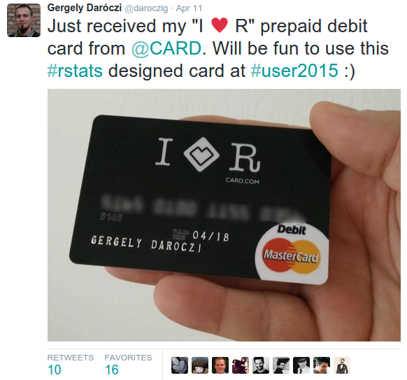

## About me

\centering

\includegraphics[width=0.95\textwidth]{images/java}

## About me

\begin{columns}
\begin{column}{0.5\textwidth}
    \begin{center}
     \includegraphics[width=0.99\textwidth]{images/hunr}
     \end{center}
\end{column}
\begin{column}{0.5\textwidth}%%
    \begin{center}
     \includegraphics[width=0.8\textwidth]{images/satrday}
     \end{center}
\end{column}
\end{columns}

\centering \includegraphics[width=0.7\textwidth]{images/rapporter}

## About me

\centering

\includegraphics[width=0.99\textwidth]{images/gh-2015-2016}

## CARD.com's View of the World

\centering

\includegraphics[width=0.7\textwidth]{images/twit}

foo



## CARD.com's View of the World

<!--
anyway, we have of course other designs as well (like several thousands), which is pretty cool for data scientist like us -- to compare the behaviour and compute the performance of eg a "walking dead" or "grumpy cat" cardholder -- which is, believe it or not, different!
-->

\includegraphics[width=0.99\textwidth]{images/ajay3}

## Modern Marketing at CARD.com

\centering

\includegraphics[width=0.9\textwidth]{images/modern_marketing}

## Further Data Partners

* card transaction processors
* card manufacturers
* CIP/KYC service providers
* online ad platforms
* remarketing networks
* licensing partners
* communication engines
* others

## My View on CARD.com

\centering

\includegraphics[width=0.99\textwidth]{images/stack}

<!--
* MySQL
* HDFS, Hive
* Impala, Parquet
* RImpala, CSV export, RJDBC
* nightly, hourly cron jobs
* drush scripts
* Pentaho, Java, python
-->

## Why not Hadoop instead of MySQL?

<!-- I hope there aren't many big data engineers here -->

\vspace*{-6.5mm}

\hspace*{-19mm}

\centering
\includegraphics[width=0.91\paperwidth]{images/rapporter_infra}

## Infrastructure

\centering

\includegraphics[width=0.99\textwidth]{images/stack}

## Why R?

<!-- I told you I'm not a Java person -->

\centering

\includegraphics[width=0.9\textwidth]{images/pentaho}

## Why Amazon Kinesis?

\centering

\includegraphics[width=0.99\textwidth]{images/kinesis-architecture-crop}

\footnotesize Source: [Kinesis Product Details](https://aws.amazon.com/kinesis/streams/details/)

## Intro to Amazon Kinesis Streams

\centering

\includegraphics[width=0.99\textwidth]{images/kinesis-architecture-streams}

\footnotesize Source: [Kinesis Developer Guide](http://docs.aws.amazon.com/streams/latest/dev/key-concepts.html)

## Intro to Amazon Kinesis Shards

\centering

\includegraphics[width=0.99\textwidth]{images/kinesis_core_concepts}

\footnotesize Source: [AWS re:Invent 2013](http://www.slideshare.net/AmazonWebServices/amazon-kinesis-realtime-streaming-big-data-processing-applications-bdt311-aws-reinvent-2013)

## Deep Learning

\centering \vfill \vspace{1cm}

\includegraphics[width=0.99\textwidth]{images/firehose1}

\pause

\includegraphics[width=0.85\textwidth]{images/firehose2}

\footnotesize Source: awscloud Twitter account

## The S3 Object System 

```r
> x <- 3.14
> attr(x, 'class') <- 'standard'

> print.standard <- function(x, ...) {
+     ## SLA
+     if (runif(1) * 100 > 99.9) {
+         Sys.sleep(20)
+     }
+     futile.logger::flog.info(x)    
+ }

> while (TRUE) print(x)
INFO [2017-03-03 22:27:57] 3.14
INFO [2017-03-03 22:27:57] 3.14
INFO [2017-03-03 22:27:57] 3.14
INFO [2017-03-03 22:28:17] 3.14
INFO [2017-03-03 22:28:17] 3.14
```

## S4: Multiple Dispatch

\centering

\includegraphics[width=0.9\textwidth]{images/kinesis_and_firehose}

## Example use-case

<!-- https://www.lucidchart.com/documents/edit/e91c90f6-7476-4e6a-834c-7198b857bffa?driveId=0ACjOYacj5XqBUk9PVA# -->

\centering

\includegraphics[width=0.99\textwidth]{images/example-stream}

## How to Communicate with Kinesis

Writing data to the stream:

* [Amazon Kinesis Streams API](http://docs.aws.amazon.com/streams/latest/dev/developing-producers-with-sdk.html), SDK
* [Amazon Kinesis Producer Library (KPL)](http://docs.aws.amazon.com/streams/latest/dev/developing-producers-with-kpl.html) from Java
* [flume-kinesis](https://github.com/sharethrough/flume-kinesis)
* [Amazon Kinesis Agent](http://docs.aws.amazon.com/firehose/latest/dev/writing-with-agents.html)

Reading data from the stream:

* [Amazon Kinesis Streams API](http://docs.aws.amazon.com/streams/latest/dev/developing-consumers-with-sdk.html), SDK
* [Amazon Kinesis Client Library (KCL)](http://docs.aws.amazon.com/streams/latest/dev/developing-consumers-with-kcl.html) from Java, Node.js, .NET, Python, Ruby

Managing streams:

* [Amazon Kinesis Streams API](http://docs.aws.amazon.com/streams/latest/dev/working-with-streams.html) (!)

## Now We Need an R Client!

\scriptsize

```r
> library(rJava)
> .jinit(classpath = list.files('~/Projects/AWR/inst/java/', full.names = TRUE))

> kc <- .jnew('com.amazonaws.services.kinesis.AmazonKinesisClient')
> kc$setEndpoint('kinesis.us-west-2.amazonaws.com', 'kinesis', 'us-west-2')

> sir <- .jnew('com.amazonaws.services.kinesis.model.GetShardIteratorRequest')
> sir$setStreamName('test_kinesis')
> sir$setShardId(.jnew('java/lang/String', '0'))
> sir$setShardIteratorType('TRIM_HORIZON')
> iterator <- kc$getShardIterator(sir)$getShardIterator()

> grr <- .jnew('com.amazonaws.services.kinesis.model.GetRecordsRequest')
> grr$setShardIterator(iterator)
> kc$getRecords(grr)$getRecords()
[1] "Java-Object{[{SequenceNumber: 49562894160449444332153346371084313572324361665031176210,
ApproximateArrivalTimestamp: Tue Jun 14 09:40:19 CEST 2016,
Data: java.nio.HeapByteBuffer[pos=0 lim=6 cap=6],PartitionKey: 42}]}"

> sapply(kc$getRecords(grr)$getRecords(),
+        function(x)
+        rawToChar(x$getData()$array()))
[1] "foobar"
```

<!-- more painful than writing actual Java code -->

## Managing Shards via the Java SDK

\normalsize Let's merge two shards: \scriptsize

```r
> ms <- .jnew('com.amazonaws.services.kinesis.model.MergeShardsRequest')
> ms$setShardToMerge('shardId-000000000000')
> ms$setAdjacentShardToMerge('shardId-000000000001')
> ms$setStreamName('test_kinesis')
> kc$mergeShards(ms)
```

\normalsize What do we have now? \scriptsize

```r
> kc$describeStream(StreamName = 'test_kinesis')$getStreamDescription()$getShards()
[1] "Java-Object{[
{ShardId: shardId-000000000000,HashKeyRange: {StartingHashKey: 0,EndingHashKey: 170141183460469231731687303715884105727},
SequenceNumberRange: {
StartingSequenceNumber: 49562894160427143586954815717376297430913467927668719618,
EndingSequenceNumber: 49562894160438293959554081028945856364232263390243848194}},
{ShardId: shardId-000000000001,HashKeyRange: {StartingHashKey: 170141183460469231731687303715884105728,EndingHashKey: 340282366920938463463374607431768211455},
SequenceNumberRange: {
StartingSequenceNumber: 49562894160449444332153346340517833149186116289174700050,
EndingSequenceNumber: 49562894160460594704752611652087392082504911751749828626}},
{ShardId: shardId-000000000002,
ParentShardId: shardId-000000000000,
AdjacentParentShardId: shardId-000000000001,
HashKeyRange: {StartingHashKey: 0,EndingHashKey: 340282366920938463463374607431768211455},
SequenceNumberRange: {StartingSequenceNumber: 49562904991497673099704924344727019527317066854965444642,}}]}"
```

## Amazon Kinesis Client Library

* An *easy-to-use* programming model for processing data

```bash
java -cp amazon-kinesis-client-1.7.3.jar \
  com.amazonaws.services.kinesis.multilang.MultiLangDaemon \
  app.properties
```

* *Scalable* and *fault-tolerant* processing (checkpointing via DynamoDB)
* Logging and metrics in CloudWatch
* The **MultiLangDaemon** spawns processes written in any language, communication happens via JSON messages sent over stdin/stdout
* Only a few events/methods to care about in the consumer application:
    1. initialize
	2. processRecords
	3. checkpoint
	4. shutdown


## Messages from the KCL

<!--
https://github.com/awslabs/amazon-kinesis-client/blob/master/src/main/java/com/amazonaws/services/kinesis/multilang/package-info.java
-->

1. **initialize**:
    * Perform initialization steps
    * Write "status" message to indicate you are done
    * Begin reading line from STDIN to receive next action
2. **processRecords**:
    * Perform processing tasks (you may write a checkpoint message at any time)
	* Write "status" message to STDOUT to indicate you are done.
	* Begin reading line from STDIN to receive next action
3. **shutdown**:
	* Perform shutdown tasks (you may write a checkpoint message at any time)
	* Write "status" message to STDOUT to indicate you are done.
	* Begin reading line from STDIN to receive next action
4. **checkpoint**:
	* Decide whether to checkpoint again based on whether there is an error or not.

## Again: Why R?

\centering

\includegraphics[width=0.9\textwidth]{images/pentaho}

## R Script Interacting with KCL

\scriptsize

```r
#!/usr/bin/r -i

while (TRUE) {

    ## read and parse JSON messages
    line <- fromJSON(readLines(n = 1))

    ## nothing to do unless we receive records to process
    if (line$action == 'processRecords') {

        ## process each record
        lapply(line$records, function(r) {

            business_logic(fromJSON(rawToChar(base64_dec(r$data))))
            cat(toJSON(list(action = 'checkpoint', checkpoint = r$sequenceNumber)))

        })
    }

    ## return response in JSON
    cat(toJSON(list(action = 'status', responseFor = line$action)))

}
```

## R Script Interacting with KCL

\vspace*{-0.74cm}
\hspace*{-6pt}\makebox[0.999\linewidth][c]{%
\includegraphics[width=\paperwidth]{images/r-consumer-bugs}
}

## Get rid of the bugs and the boilerplate

\scriptsize

```r
> install.packages('AWR.Kinesis')
also installing the dependency ‘AWR’

trying URL 'https://cloud.r-project.org/src/contrib/AWR_1.11.89.tar.gz'
Content type 'application/x-gzip' length 3125 bytes

trying URL 'https://cloud.r-project.org/src/contrib/AWR.Kinesis_1.7.3.tar.gz'
Content type 'application/x-gzip' length 3091459 bytes (2.9 MB)

* installing *source* package ‘AWR’ ...
** testing if installed package can be loaded
trying URL 'https://gitlab.com/cardcorp/AWR/repository/archive.zip?ref=1.11.89'
downloaded 58.9 MB
* DONE (AWR)

* installing *source* package ‘AWR.Kinesis’ ...
* DONE (AWR.Kinesis)
```

## Add content to the boilerplate

Business logic coded in R (demo_app.R):

\scriptsize

```r
library(AWR.Kinesis)
kinesis_consumer(processRecords = function(records) {
    flog.info(jsonlite::toJSON(records))
})
```

\pause

\begin{alertblock}{Note}
This is not something you should run in RStudio.
\end{alertblock}

\vfill \vspace{5mm} \vfill \vfill \vspace{5mm} \vfill \vspace{13mm} \vfill

## Add content to the boilerplate

Business logic coded in R (demo_app.R):

\scriptsize

```r
library(AWR.Kinesis)
kinesis_consumer(processRecords = function(records) {
    flog.info(jsonlite::toJSON(records))
})
```

\normalsize
Config file for the MultiLangDaemon (demo_app.properties): 
\scriptsize

```bash
executableName = ./demo_app.R
streamName = demo_stream
applicationName = demo_app
```

\normalsize
Start the MultiLangDaemon:
\scriptsize


```bash
/usr/bin/java -cp AWR/java/*:AWR.Kinesis/java/*:./ \
    com.amazonaws.services.kinesis.multilang.MultiLangDaemon \
    ./demo_app.properties
```

## ''Advanced'' AWR.Kinesis features

\scriptsize

```r
library(futile.logger)
library(AWR.Kinesis)

kinesis_consumer(

    initialize     = function()
        flog.info('Hello'),

    processRecords = function(records)
        flog.info(paste('Received', nrow(records), 'records from Kinesis')),

    shutdown       = function()
        flog.info('Bye'),

    updater        = list(
        list(1, function()
            flog.info('Updating some data every minute')),
        list(1/60*10, function()
            flog.info(paste(
                'This is a high frequency updater call',
                'running every 10 seconds')))),
    
    checkpointing = 1,
    logfile = '/logs/logger.log')
```

## Let's run it locally!

\begin{alertblock}{Note}
In theory you could, but this is not something you should run in RStudio.
\end{alertblock}

1. Create a Kinesis Stream
2. Create an IAM user with DynamoDB and Kinesis permissions
3. Write data to the Stream
4. Run the MultiLangDaemon referencing the properties file

\pause

\centering \includegraphics[width=0.6\textwidth]{images/demo}

## Create a Kinesis Stream

\centering \includegraphics[width=0.75\textwidth]{images/aws-demo-1}

## Create a Kinesis Stream

\centering \includegraphics[width=0.75\textwidth]{images/aws-demo-2}

## Check the Kinesis Stream

\centering \includegraphics[width=0.75\textwidth]{images/aws-demo-3}

## Create an IAM user

\centering \includegraphics[width=0.75\textwidth]{images/aws-demo-4}

## Write Data to the Stream from R

\scriptsize

```r
library(rJava)
.jcall("java/lang/System", "S", "setProperty", "aws.profile", "personal")

library(AWR.Kinesis)
library(jsonlite)
library(futile.logger)
library(nycflights13)
while (TRUE) {

    ## pick a ~car~flight
    flight <- flights[sample(1:nrow(flights), 1), ]

    ## prr <- .jnew('com.amazonaws.services.kinesis.model.PutRecordRequest')
    ## prr$setStreamName('test1')
    ## prr$setData(J('java.nio.ByteBuffer')$wrap(.jbyte(charToRaw(toJSON(car)))))
    ## prr$setPartitionKey(rownames(car))
    ## kc$putRecord(prr)

    res <- kinesis_put_record(stream = 'test-AWR', region = 'us-east-1',
                              data = toJSON(flight), partitionKey = flight$dest)
    flog.info(paste('Pushed a new flight to Kinesis:', res$sequenceNumber))

}
```

## Write Data to the Stream from R

\centering \includegraphics[width=0.9\textwidth]{images/putrecords}


## Reading Data from the Stream

\scriptsize

```r
## get an iterator
sir <- .jnew('com.amazonaws.services.kinesis.model.GetShardIteratorRequest')
sir$setStreamName('test-AWR')
sir$setShardId(.jnew('java/lang/String', '0'))
sir$setShardIteratorType('TRIM_HORIZON')
kc <- .jnew('com.amazonaws.services.kinesis.AmazonKinesisClient')
kc$setEndpoint('kinesis.us-east-1.amazonaws.com')
iterator <- kc$getShardIterator(sir)$getShardIterator()

## get records
grr <- .jnew('com.amazonaws.services.kinesis.model.GetRecordsRequest')
grr$setShardIterator(iterator)
records <- kc$getRecords(grr)$getRecords()

## transform to string
json <- sapply(records, function(x)
    rawToChar(x$getData()$array()))

## decode JSON
json[1]
fromJSON(json[1])
rbindlist(lapply(json, fromJSON))
```

## Running the MultiLangDaemon locally

\centering \includegraphics[width=0.99\textwidth]{images/awr-kinesis-local}

## This Kinesis app is being run

\scriptsize

```r
library(futile.logger)
library(AWR.Kinesis)

kinesis_consumer(

    initialize     = function()
        flog.info('Hello'),

    processRecords = function(records)
        flog.info(paste('Received', nrow(records), 'records from Kinesis')),

    shutdown       = function()
        flog.info('Bye'),

    updater        = list(
        list(1, function()
            flog.info('Updating some data every minute')),
        list(1/60*10, function()
            flog.info(paste(
                'This is a high frequency updater call',
                'running every 10 seconds')))),
    
    checkpointing = 1,
    logfile = '/logs/logger.log')
```

## Running the MultiLangDaemon locally

\centering \includegraphics[width=0.99\textwidth]{images/awr-kinesis-local-log}

## Let's run it in AWS!

1. Dockerize your Kinesis Consumer:
    * Java
    * R
	* AWR, AWR.Kinesis packages
	* app.R
	* app.properties
	* startup command
2. Put it on Docker Hub
3. Run as a EC2 Container Service Task:
    * Create an ECS cluster
	* Create ECS Task Role
	* Create a Task definition
	* Run it (as a service)

## Dockerize your Kinesis Consumer

\centering \includegraphics[width=0.75\textwidth]{images/dockerize-1}

## Dockerize your Kinesis Consumer

\centering \includegraphics[width=0.75\textwidth]{images/dockerize-2}

## Dockerize your Kinesis Consumer

\centering \includegraphics[width=0.75\textwidth]{images/dockerize-3}

## Dockerize your Kinesis Consumer

\centering \includegraphics[width=0.75\textwidth]{images/dockerize-4}

## Put it on Docker Hub

\centering \includegraphics[width=0.75\textwidth]{images/dockerize-5}

## Create an ECS cluster

\centering \includegraphics[width=0.75\textwidth]{images/ecs-1}

## Create ECS Task Role

\centering \includegraphics[width=0.75\textwidth]{images/ecs-2}

## Create ECS Task Role

\centering \includegraphics[width=0.75\textwidth]{images/ecs-3}

## Create ECS Task Role

\centering \includegraphics[width=0.75\textwidth]{images/ecs-4}

## Create a Task definition

\centering \includegraphics[width=0.75\textwidth]{images/ecs-5}

## Create a Task definition

\centering \includegraphics[width=0.75\textwidth]{images/ecs-6}

## Create a Task definition

\centering \includegraphics[width=0.75\textwidth]{images/ecs-7}

## Create a Task definition

\centering \includegraphics[width=0.75\textwidth]{images/ecs-8}

## Run the ECS Task

\centering \includegraphics[width=0.75\textwidth]{images/ecs-9}

## Run the ECS Task

\centering \includegraphics[width=0.75\textwidth]{images/ecs-10}

## Run the ECS Task

\centering \includegraphics[width=0.99\textwidth]{images/ecs-11}

## Scaling the Kinesis Consumer  up

\centering \includegraphics[width=0.99\textwidth]{images/ecs-12}

## Kinesis Consumers in Production

Nice example project, but ...

* I might want to avoid publishing my Consumer on Docker Hub
* I might want to avoid publishing my code on GitHub
* I might want to avoid commiting credentials etc to the repo

Problems:

\begin{itemize}
	\item How to store credentials in the Docker images? \onslide<2>{\textbf{KMS}}
	\item Where to store the Docker images? \onslide<2>{\textbf{ECR}}
\end{itemize}

## KMS

\centering \includegraphics[width=0.7\textwidth]{images/kms-1}

\includegraphics[width=0.7\textwidth]{images/kms-2}

\footnotesize Source: [AWS Encryption SDK](http://docs.aws.amazon.com/encryption-sdk/latest/developer-guide/introduction.html#concepts)

## Current AWR.KMS Features

* encrypt up to 4 KB of arbitrary data: 

\scriptsize

```r
> library(AWR.KMS)
> kms_encrypt('alias/mykey', 'foobar')
[1] "Base-64 encoded ciphertext"
```

\normalsize

* decrypt such Base-64 encoded ciphertext back to plaintext:

\scriptsize

```r
> kms_encrypt('Base-64 encoded ciphertext')
[1] "foobar"
```

\normalsize

* generate a data encryption key:

\scriptsize

```r
> kms_generate_data_key('alias/mykey')
$cipher
[1] "Base-64 encoded, encrypted data encryption key"
$key
[1] "alias/mykey"
$text
[1] 00 01 10 11 00 01 10 11 ...

```

## Encrypting Data Larger Than 4 KB?

\scriptsize

```r
## let's say we want to encrypt the mtcars dataset stored in JSON
library(jsonlite)
data <- toJSON(mtcars)

## generate a 256-bit data encryption key (that's supported by digest::AES)
library(AWR.KMS)
key <- kms_generate_data_key('alias/mykey', byte = 32L)

## convert the JSON to raw so that we can use that with digest::AES
raw <- charToRaw(data)
## the text length must be a multiple of 16 bytes
## https://github.com/sdoyen/r_password_crypt/blob/master/crypt.R
raw <- c(raw, as.raw(rep(0, 16 - length(raw) %% 16)))

## encrypt the raw object with the new key + digest::AES
## the resulting text and the encrypted key can be stored on disk
library(digest)
aes <- AES(key$text)
base64_enc(aes$encrypt(raw))

## decrypt the above returned ciphertext using the decrypted key
rawToChar(aes$decrypt(base64_dec(...), raw = TRUE))
```

## Example "Production" Consumer App

\tiny

```r
library(AWR.Kinesis); library(jsonlite); library(AWR.KMS); library(futile.logger); flog.threshold(DEBUG)

kinesis_consumer(
    initialize     = function() {
        flog.info('Decrypting Redis hostname via KMS')
        host <- kms_decrypt('AQECAHiiz4GEPFQLL9AA0N5TY/lDR5euQQScpXQU9iYTn+u...')
        flog.info('Connecting to Redis')
        library(rredis); redisConnect(host = host)
        flog.info('Connected to Redis')
    },
    processRecords = function(records) {
        flog.info(paste('Received', nrow(records), 'records from Kinesis'))
        for (record in records$data) {
            flight <- fromJSON(record)$dest
            if (!is.null(flight)) {
                flog.debug(paste('Adding +1 to', flight))
                redisIncr(sprintf('flight:%s', flight))
            } else {
                flog.error('Flight destination not found')
            }
        }
    },
    updater = list(
        list(1/6, function() {
            flog.info('Checking overall counters')
            flights <- redisKeys('flight:*')
            for (flight in flights) {
                flog.debug(paste('Found', redisGet(flight), sub('^flight:', '', flight)))
            }
        })),
    logfile = '/logs/redis.log')
```

## Private Docker Image

Dockerfile: \scriptsize

```bash
FROM cardcorp/r-kinesis:latest
MAINTAINER Gergely Daroczi <gergely.daroczi@card.com>

## Install R package to interact with Redis
RUN install2.r --error rredis  && rm -rf /tmp/downloaded_packages/ /tmp/*.rds

## Add consumer
COPY files /app
```

\normalsize 
Build and push to ECR: \scriptsize

```bash
docker build -t cardcorp/r-kinesis-secret .
`aws ecr get-login --region us-east-1`
docker tag -f cardcorp/r-kinesis-secret:latest \
            ***.dkr.ecr.us-east-1.amazonaws.com/cardcorp/r-kinesis-secret:latest
docker push ***.dkr.ecr.us-east-1.amazonaws.com/cardcorp/r-kinesis-secret:latest
```

## Shiny Dashboard

\scriptsize

```r
library(treemap);library(highcharter);library(nycflights13)
library(rredis);redisConnect(host = '***', port = '***')

ui     <- shinyUI(highchartOutput('treemap', height = '800px'))
server <- shinyServer(function(input, output, session) {
    
    destinations <- reactive({
        reactiveTimer(2000)()
        flights <- redisMGet(redisKeys('flight:*'))
        flights <- data.frame(faa = sub('^flight:', '', names(flights)),
                              N   = as.numeric(flights))
        merge(flights, airports, by = 'faa')
    })

    output$treemap <- renderHighchart({
        tm <- treemap(destinations(), index = c('faa'),
                      vSize = 'N', vColor = 'tz',
                      type = 'value', draw = FALSE)
        hc_title(hctreemap(tm, animation = FALSE), text = 'Flights from NYC')
    })
    
})
shinyApp(ui = ui, server = server)
```

## Shiny Dashboard

\centering \includegraphics[width=0.75\textwidth]{images/shiny}

## Technical Details

* AWR repo: 
    * 6.3 GB
	* 273 tags/versions
	* GitLab + CI + drat 

\scriptsize

```r
install.packages('AWR', repos = 'https://cardcorp.gitlab.io/AWR')
```

\pause \normalsize

* Submitted to CRAN on
    * 2016-12-05 \pause
    * 2017-01-09
    * 2017-01-10
    * 2017-01-11
    * 2017-01-11
    * 2017-01-13 \pause
* Release cycle: 2 minor, ~125 patch versions in the past 12 months
* CI

## What's Next?

\centering \includegraphics[width=0.55\textwidth]{images/AWR}

```r
> library(rJava)
> kc <- .jnew('com.amazonaws.services.s3.AmazonS3Client')
> kc$getS3AccountOwner()$getDisplayName()
[1] "foobar"
```

----

\vspace{4mm}

\centering \includegraphics[width=0.99\textwidth]{images/success}

