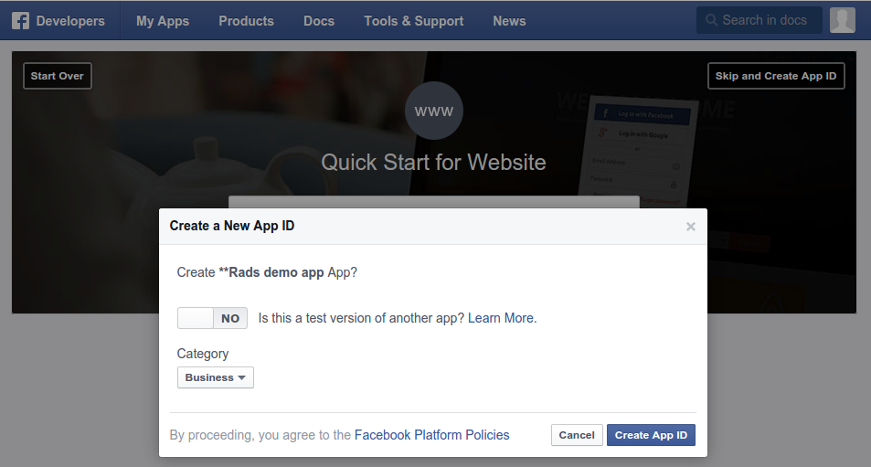

## Modern advertising

\Large

* Google knows what you are searching for

* Amazon knows what you are in the market for

* Facebook knows what you like

\vfill

\pause

* This info ~~can be~~ is used to advertise to you

## Ad Platforms

* Utilize Google search data via AdWords API

```r
## by Johannes Burkhardt
devtools::install.github('jburkhardt/RAdwords')
```

* Utilize Amazon purchase history via Amazon Ads

```r
NULL
```

* Yahoo+Bing have joint search ad network & API

```r
NULL
```

* Utilize Facebook likes & comments data via FB Marketing API 

```r
devtools::install.github('cardcorp/fbRads')
```

## When to advertise on Facebook

<!--
25% of all ad market happens on the Internet

-->

\centering


## When to advertise on Facebook

\centering


## CARD.com’s view of the world

\centering


## When to advertise on Facebook

\centering


Source: [adparlor.com](http://www.adparlor.com/facebook-website-custom-audience-targeting-the-power-of-precision)

## Modern Marketing

\centering


## Anatomy of a Facebook Ad Campaign

\centering


Source: [Facebook Marketing API docs](https://developers.facebook.com/docs/marketing-apis)

## Facebook Ad Campaign Structure Changes

* Anyone here from Facebook?

\pause

* 2 changes in the campaign structure in 2014
* 2 -> 3 hierarchical categories
* Before July 2014, "Ad Sets" were called "Campaigns"
* At the API endpoints:
    * campaigns are called `adcampaign_groups`
    * ad sets   are called `adcampaigns`
    * ads       are called `adgroups`
* When creating an ad via the API, the adset id is called `campaign_id`
* 4 new Facebook Marketing API versions in October 2014

\pause

* But it's pretty damn good

\pause

* Really!

<!--
ad (whatever is it)
-->

## Collect R package developer e-mail addresses

\footnotesize

```r
> url <- 'http://cran.r-project.org/web/checks/check_summary.html'
> packages <- readHTMLTable(url, which = 2)
> mails <- sub('.*<(.*)>', '\\1', packages$' Maintainer')
> mails <- sub(' at ', '@', mails)
```

\pause

```r
> tail(sort(table(mails)))
## Dirk Eddelbuettel (35)
## Kurt Hornik (29)
## Scott Chamberlain (24)
## Martin Maechler (24)
## Paul Gilbert (22)

> length(unique(mails))
## 4023

> tail(sort(table(sub('.*@', '', mails))))
## gmail.com (1778)
## R-project.org (84)
## edu
```

## Collect R package developer e-mail addresses

\centering


28 % match: only 900 accounts for 6,000+ R packages

## Collect e-mail addresses from the R-help mailing list

\footnotesize

Get the location of the archives:
```r
> url <- 'https://stat.ethz.ch/pipermail/r-help/'
```

We need RCurl for HTTPS:
```r
> library(RCurl)
```

Get URL of all archive files:
```r
> R.help.toc <- htmlParse(getURL(url))
> R.help.archives <- unlist(
+     xpathApply(R.help.toc, "//table//td[3]/a", xmlAttrs),
+     use.names = FALSE)
```

Download archive files:
```r
> dir.create('r-help')
> for (f in R.help.archives)
+     download.file(url = paste0(url, f),
+                   file.path('help-r', f), method = 'curl')
```

## Extract e-mail addresses from the R-help mailing list

Regular expression matching date format in "From" lines:
```r
> dateregex <- paste('[A-Za-z]{3} [A-Za-z]{3} [0-9]{1,2}',
+                    '[0-9]{2}:[0-9]{2}:[0-9]{2} [0-9]{4}')
```

`grep` for lines matching the `From` field:
```r
> mails <- system(paste0(
+     "zgrep -E '^From .* at .* ",
+     dateregex,
+     "' ./help-r/*.txt.gz"),
+                 intern = TRUE)
```

Extract e-mail addresses from these lines:
```r
> mails <- sub('.*From ', '', mails)
> mails <- sub(paste0('[ ]*', dateregex, '$'), '', mails)
> mails <- sub(' at ', '@', mails)
```

## Extracted e-mail addresses from the R-help mailing list

```r
> length(mails)
266449

> head(sort(table(mails), decreasing = TRUE))
   ripley@stats.ox.ac.uk   dwinsemius@comcast.net
                    8611                     7064
 ggrothendieck@gmail.com p.dalgaard@biostat.ku.dk
                    5386                     3243
      jholtman@gmail.com   smartpink111@yahoo.com
                    3193                     2999

> length(unique(mails))
29266

> 29266 > 4023
TRUE \o/
```

## Authenticate with the Facebook API

\centering



https://developers.facebook.com/apps/

## Authenticate with the Facebook API

Create a token: \footnotesize

```r
> library(httr)
> app <- oauth_app('facebook', 'your_app_id', 'your_app_secret')
> tkn <- oauth2.0_token(
+   oauth_endpoints('facebook'), app, scope = 'ads_management',
+   type  = 'application/x-www-form-urlencoded')
> tkn <- tkn$credentials$access_token
```

\normalsize
Save this secret token (never commit to git repository) and load it in any later session: \footnotesize

```r
> saveRDS(tkn, 'token.rds')
> tkn <- readRDS('token.rds')
```

\normalsize
Initialize connection to Facebook Marketing API:
\footnotesize

```r
> fbacc <- fbad_init(fid, tkn)
```

## Create custom audience

```r
> aud_id <- fbad_create_audience(fbacc, 'R-help posters',
+  'Unique e-mail addresses in R-help 1997-2015')
```

Reading audience info:
```r
> fbad_read_audience(fbacc, aud_id, 'approximate_count')
20
```

Adding e-mails to audience:
```r
> fbad_add_audience(fbacc, aud_id, 'EMAIL', mails)
```

It usually takes a day or two for custom audiences to fully populate :(
```r
> fbad_read_audience(fbacc, aud_id, 'approximate_count')
8700
```

## Create lookalike audiences

\footnotesize

Load the number of attendees per country (see my poster tomorrow!):
```r
> url <- 'http://rapporter.net/custom/R-activity/data/Rstats_2015.csv'
> library(data.table)
> RpC <- fread(url)
> user2015  <- RpC[user_2015 > 0, ]
```

Create a lookalike audience for each country:
```r
> aud_ids <- sapply(1:nrow(user2015), function(i) {
+
+   try(fbad_create_lookalike_audience(
+     fbacc,
+     name               = paste('R-help posters in', user2015[i, NAME]),
+     origin_audience_id = aud_id,
+     ratio              = 0.01,
+     country            = toupper(user2015[i, ISO2C])))
+ 
+   Sys.sleep(20)
+ 
+ })
```

## Read lookalike audiences

\footnotesize

Get the approximate count of each lookalike audience:
```r
> lookalikes[!is.na(audience),
+     size := fbad_read_audience(fbacc, audience, 'approximate_count')[[1]],
+     by = country]

> lookalikes[!is.na(audience), c('country', 'size'), with = FALSE]
           country    size                     country    size
 1:      Australia  173000          13:        Ireland   32800
 2:        Austria   41500          14:          Italy  336200
 3:        Belgium   72400          15:         Latvia    7800
 4:         Brazil 1280400          16:         Mexico  758100
 5:         Canada  253100          17:    Netherlands  110900
 6:       Colombia  308200          18:    New Zealand   34500
 7:  Faroe Islands     400          19:         Norway   36500
 8:         France  392900          20:      Singapore  257000
 9:        Germany  347700          21:       Slovenia   11200
10:         Greece   59900          22:          Spain  284200
11:        Hungary   61500          23:    Switzerland   43100
12:          India 2042000          24: United Kingdom  478700
                                    25:  United States 2483200
```

## Create a campaign

\footnotesize

```r
> campaign <- fbad_create_campaign(fbacc,
+               name = 'Promote my useR! 2015 talk')
> fbad_read_campaign(fbacc, campaign)
$id
[1] "********"

$account_id
[1] "********"

$buying_type
[1] "AUCTION"

$campaign_group_status
[1] "ACTIVE"

$objective
[1] "NONE"

$name
[1] "Promote my useR! 2015 talk"

```

## Define target for an adset

All valid lookalike audiences:
```r
> target <- lookalikes[!is.na(audience)]
> setnames(target, c('name', 'id'))
```

The original R-help posters list:
```r
> target <- rbind(target, list('R-help poster list', id1))
```

The original R package developers list:
```r
> target <- rbind(target, list('R pkg developers list', id2))
```

Prepare JSON list:
```r
> target <- list(custom_audiences = target)
```

## Create an adset

```r
> adset <- fbad_create_adset(
+     fbacc,
+     name = 'My budget for promoting my useR! 2015 talk',
+     campaign_group_id = campaign,
+     bid_type = 'CPC',
+     bid_info = list(CLICKS = 42),
+     campaign_status = 'ACTIVE',
+     lifetime_budget = 4200,
+     end_time = as.numeric(as.POSIXct('2015-07-01')),
+     targeting = target)
```

## Upload image

Get an image for the ad:
\footnotesize

```r
> img <- 'user_2015_logo.png'
> download.file('http://user2015.math.aau.dk/gfx/useR2015.png', img)
```

\normalsize
Upload to Facebook:
\footnotesize

```r
> img <- fbad_create_image(fbacc, img)
```

\normalsize
Take a note on the returned hash:
\footnotesize

```r
> str(img)
List of 3
 $ filename: chr "user_2015_logo.png"
 $ hash    : chr "140423d688a2e71a6b0cbfd4d65526aa"
 $ url     : chr "https://fbcdn-creative-a.akamaihd.net/hads-ak-xft1/t45.1600-4/11410296_6024889747763_1444747968_n.png"
> img <- img$hash 
```

## Create a creative

```r
> url <- 'http://user2015.math.aau.dk/contributed_talks#210'
> creative <- fbad_create_creative(
+     fbacc,
+     name = 'How to create ads from R?',
+     body = paste(
+         'Learn how to create Facebook ads from R',
+         'at a contributed talk',
+         'at the useR! 2015 conference'),
+     title      = 'How to create ads from R?',
+     object_url = url,
+     image_hash = img$hash)
```

## Create a creative

\centering


## Create an ad

```r
> ad <- fbad_create_ad(
+     fbacc,
+     name        = 'An ad -- right from the R console',
+     campaign_id = adset,
+     creative    = creative)
```

## A/B testing

\tiny

```r
> images <- c('http://www.r-project.org/Rlogo.png',
+             'http://user2014.stat.ucla.edu/images/useR-middle.png')

> for (l in 1:length(images)) {
+
+     ## download image
+     img <- tempfile(fileext = '.png'); download.file(images[i], img)
+
+     ## resize, then upload image
+     system(paste('convert', img, '-resize 350x150^', img))
+     img <- fbad_create_image(fbacc, img)
+
+     ## create creative
+     url <- 'http://user2015.math.aau.dk/contributed_talks#210'
+     creative <- fbad_create_creative(
+         fbacc,
+         name = 'How to create ads from R?',
+         body = paste(
+             'Learn how to create Facebook ads from R',
+             'at a contributed talk at the useR! 2015 conference'),
+         title      = 'How to create ads from R?',
+         object_url = url,
+         image_hash = img$hash)
+
+     ## create ad
+     ad <- fbad_create_ad(
+         fbacc,
+         name        = paste0('An ad -- right from the R console (', toupper(letters[i]), ')'),
+         campaign_id = adset,
+         creative    = creative)
+
+ }
```

## Performance metrics

\centering


## Performance metrics

No functions yet, DIY! But it's pretty easy:
```r
> res <- fbRads:::fbad_request(
+     path   = paste0(fbacc$acct_path, 'adgroupstats'),
+     params = list(access_token = fbacc$access_token))

> jsonlite::fromJSON(res)$data[, c(
+    'impressions',
+    'unique_impressions',
+    'clicks',
+    'unique_clicks',
+    'spent')]
  impressions unique_impressions clicks unique_clicks spent
1       31655              16332     24            23   328
2      134902              55421    169           153  2361
3       90769              40560    107            98  1477
```

## Performance metrics

\tiny

```{r, prompt=TRUE, comment=''}
power.prop.test(p1 = 169 / 135000, p2 = 24 / 31000, power = 0.5, sig.level = 0.05)
fisher.test(data.frame(B = c(169, 135000), A = c(24, 31000)), conf.int = FALSE)
```

## Performance metrics

\centering


----

\centering

https://github.com/cardcorp/fbRads


Not many public functions yet, so DIY! But it's pretty easy:

Pull requests are welcomed!
