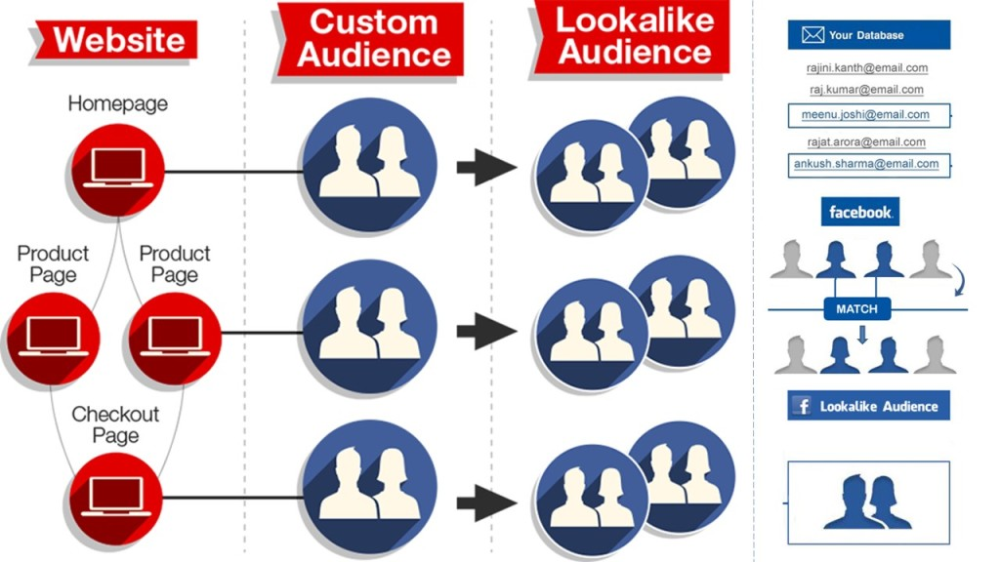

## When to advertise on Facebook

\centering


## When to advertise on Facebook

\centering


## CARD.com’s view of the world

\centering


## When to advertise on Facebook

\centering



Source: [adparlor.com](http://www.adparlor.com/facebook-website-custom-audience-targeting-the-power-of-precision)

## Anatomy of a Facebook Ad Campaign

\centering


Source: [Facebook Marketing API docs](https://developers.facebook.com/docs/marketing-apis)

## Collect e-mail addresses from the R-help mailing list

\tiny

Get the location of the archives:
```r
> url <- 'https://stat.ethz.ch/pipermail/r-help/'
```

Get the URL of all archive files:
```r
> library(RCurl)
> R.help.toc <- htmlParse(getURL(url))
> R.help.archives <- unlist(
+     xpathApply(R.help.toc, "//table//td[3]/a", xmlAttrs),
+     use.names = FALSE)
```

Download archive files:
```r
> dir.create('r-help')
> for (f in R.help.archives)
+     download.file(url = paste0(url, f),
+                   file.path('help-r', f), method = 'curl')
```

Regular expression matching date format in "From" lines:
```r
> dateregex <- paste('[A-Za-z]{3} [A-Za-z]{3} [0-9]{1,2} [0-9]{2}:[0-9]{2}:[0-9]{2} [0-9]{4}')
```

Extract e-mail addresses from these lines:
```r
> mails <- system(paste0("zgrep -E '^From .* at .* ", dateregex, "' ./help-r/*.txt.gz"), intern = TRUE)
> mails <- sub('.*From ', '', mails)
> mails <- sub(paste0('[ ]*', dateregex, '$'), '', mails)
> mails <- sub(' at ', '@', mails)
```


## Authenticate with the Facebook API

\centering


## Create custom and lookalike audiences

\tiny

Create a custom audience:

```r
> aud_id <- fbad_create_audience(name = 'R-help posters',
+     title = 'Unique e-mail addresses in R-help 1997-2015')

> fbad_read_audience(audience_id = aud_id, fields = 'approximate_count')
20
```

Seed it:

```r
> fbad_add_audience(audience_id = aud_id, schema = 'EMAIL', hashes = mails)
```

Wait an hour or so:

```r
> fbad_read_audience(audience_id = aud_id, fields = 'approximate_count')
8700
```

Then create a lookalike audience based on that:

```r
> fbad_create_lookalike_audience(origin_audience_id = aud_id, ratio = 0.01, country = 'HU')

> fbad_read_audience(audience_id = audience, fields = 'approximate_count')
61500
```

## Create an Ad Campaign and Ad Set

\scriptsize

Create the container:

```r
> campaign <- fbad_create_campaign(name = 'Promoting my BURN lightning talk')
```

Define the target:

```r
> target <- list(name = 'HUN R-help posters', id = aud_id)
```

Deploy the budget:

```r
> adset <- fbad_create_adset(
+     name = 'My budget for promoting my BURN lightning talk',
+     campaign_group_id = campaign,
+     bid_type = 'CPC',
+     bid_info = list(CLICKS = 42),
+     campaign_status = 'ACTIVE',
+     lifetime_budget = 4200,
+     end_time = as.numeric(as.POSIXct('2015-09-30')),
+     targeting = target)
```

## We need a creative!

\tiny

Get an image for the ad:

```r
> img <- 'R-tricolor.png'
> download.file('http://photos3.meetupstatic.com/photos/event/b/c/2/c/global_399768172.jpeg', img)
```

Upload to Facebook:

```r
> img <- fbad_create_image(img = img)
```

Take a note on the returned hash:

```r
> str(img)
List of 3
 $ filename: chr "R-tricolor.png"
 $ hash    : chr "b8568971f4673927cd9e823645d9f991"
 $ url     : chr "https://scontent.xx.fbcdn.net/hads-xat1/t45.1600-4/12061211_6040312377320_402554620_n.png"
> img <- img$hash 
```

Define the creative:

```r
> creative <- fbad_create_creative(
+     fbacc,
+     name = 'HUN text and tricolor R logo as the ad creatives',
+     body = paste(
+         'Ingyenes előadás a Facebook hirdetések',
+         'optimalizálásáról a következő R meetupon'),
+     title      = 'Online marketing R felhasználóknak',
+     object_url = 'http://www.meetup.com/Budapest-Users-of-R-Network/events/225331913/',
+     image_hash = img$hash)
```

## Create the ad

\tiny

```r
> ad <- fbad_create_ad(
+     name        = 'An ad -- right from the R console',
+     campaign_id = adset,
+     creative    = creative)
```

\centering
\includegraphics[width=0.5\textwidth]{images/HUNad2.png}

## A/B testing

\tiny

```r
> images <- c('http://www.r-project.org/Rlogo.png',
+             'http://photos3.meetupstatic.com/photos/theme_head/4/e/c/c/full_3200172.jpeg')

> for (l in 1:length(images)) {
+
+     ## download image
+     img <- tempfile(fileext = '.png'); download.file(images[i], img)
+
+     ## resize, then upload image
+     system(paste('convert', img, '-resize 350x150^', img))
+     img <- fbad_create_image(fbacc, img)
+
+     ## create creative
+     url <- 'http://www.meetup.com/Budapest-Users-of-R-Network/events/225331913/'
+     creative <- fbad_create_creative(
+         fbacc,
+         name = 'Online marketing R felhasználóknak',
+         body = paste(
+             'Ingyenes előadás a Facebook hirdetések',
+             'optimalizálásáról a következő R meetupon'),
+         title      = 'Online marketing R felhasználóknak',
+         object_url = url,
+         image_hash = img$hash)
+
+     ## create ad
+     ad <- fbad_create_ad(
+         fbacc,
+         name        = paste0('An ad -- right from the R console (', toupper(letters[i]), ')'),
+         campaign_id = adset,
+         creative    = creative)
+
+ }
```

## Performance metrics

\tiny

```r
> res <- fbRads:::fbad_request(path   = paste0(fbacc$acct_path, 'adgroupstats'),
+                              params = list(access_token = fbacc$access_token))

> jsonlite::fromJSON(res)$data[, c('impressions', 'unique_impressions',
+                                  'clicks', 'unique_clicks', 'spent')]
  impressions unique_impressions clicks unique_clicks spent
1      127330              43389     64            60  1457
2      124150              42862     70            69  1395
3      118887              41497     48            46  1351

> power.prop.test(p1 = 48 / 118887, p2 = 70 / 124150, power = 0.5, sig.level = 0.05)

     Two-sample comparison of proportions power calculation 

              n = 144959.8
             p1 = 0.0004037447
             p2 = 0.0005638341
      sig.level = 0.05
          power = 0.5
    alternative = two.sided

> fisher.test(data.frame(B = c(46, 118887), A = c(69, 124150)), conf.int = FALSE)

	Fisher's Exact Test for Count Data

data:  data.frame(B = c(46, 118887), A = c(69, 124150))
p-value = 0.06187
alternative hypothesis: true odds ratio is not equal to 1
sample estimates:
odds ratio 
  0.696183 
```

----

\centering

https://github.com/cardcorp/fbRads


