<!--

welcome everyone to the Domino Data Lab webinar on creating .... Fb ads,

my name is Gergely Daroczi, I'm an R developer at CARD.com, a prepaid debit card startup in Santa Monica, where we created this R package that I'll demo and present to you in a few minutes...

But first - for those who are not familiar with Domino Data Lab, please let me show this quick overview on this very cool service & platform

Domino Data Lab is a Data Science Platform with a pretty intuitive interface to use different analytic tools, such as R, python, Julia, H2O etc -- and believe me, this is not a marketing slogen that I was asked to read up for you -- it's indeed intuitive and fun to use - eg I could setup a custom project using environment variables, you know,  not to share private information (as my FB token) within the publicly available source code, I cached the installed R packages to speed up the run time of the project, also created a web front-end for this small app so that non-technical users can generate reports on their own -- all done in in like 30 mins -- without any prior experience with Domino. I found this very impressive.

What I especially liked in the platform is the collaboration features, which is a step forward compared to what we have with a standard git or subversion repository -- here you can easily comment on and discuss/rerun the results, not only the source code.

In short: this is very cool, if we will have some time at the end of this webinar, I can show the quick app I created here to interact with the Facebook Marketing API.... Which is our main topic today ... so ... next slide.
-->

## About me

\centering

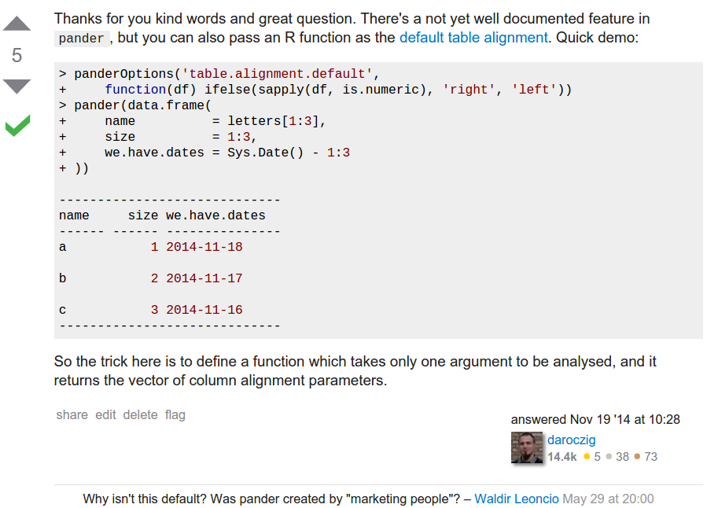

<!--

Yeah, so few words about me ... I've done quite many things in the pasts ~10 years, besides using R since 2004, I worked as a homeless outreach and social worker, I was teaching stats and data analysis for like 5 years, doing my PhD in Sociology, I founded the R meetup at Budapest and also an R-based reporting startup, did some R-related consultancy ... but I was never involved in any marketing project... still I was referred to as "marketing people" because of the default settings in one of my R packages -- centering cells in a markdown table.

At that time, I felt heavily offended ... but then ... independently from this Stackoverflow thread, I indeed ended up doing reporting and optimizations of online ads -- and  realized that there are some interesting data science questions and very rich data when dealing with online marketing, so I ended up enjoying this ... let's see why:

bearing in mind that I AM NOT A MARKETER, let me try to explain why to advertize on FB :)

-->

## When to Advertise on Facebook

<!--
although is is a very outdated and well-known social networking map, but still a good summary on that there are many users actively using social networks -- where it's relatively easy to reach them -- compared to eg traditional marketing. 
-->

\centering

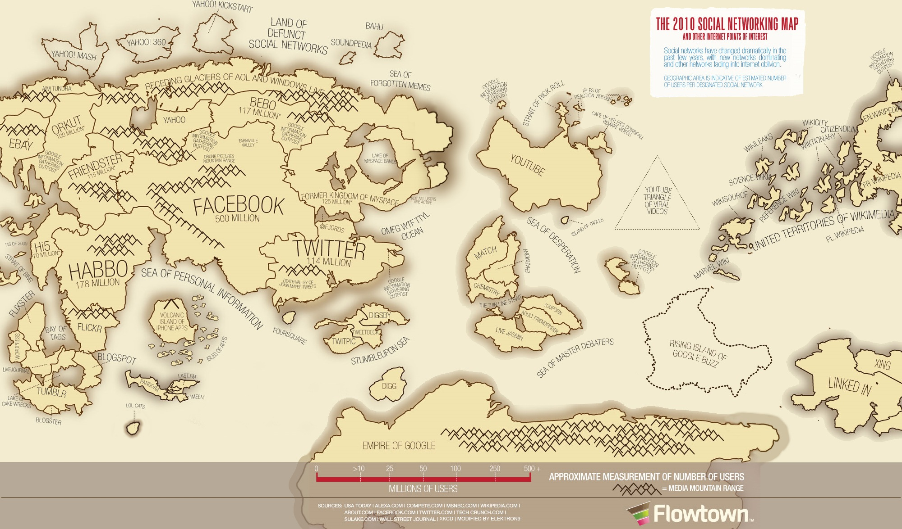

## When to Advertise on Facebook

<!--
why 25% of all ad market happens on the Internet
well, than percentage can be a lot higher depending on your target audience...
-->

\centering

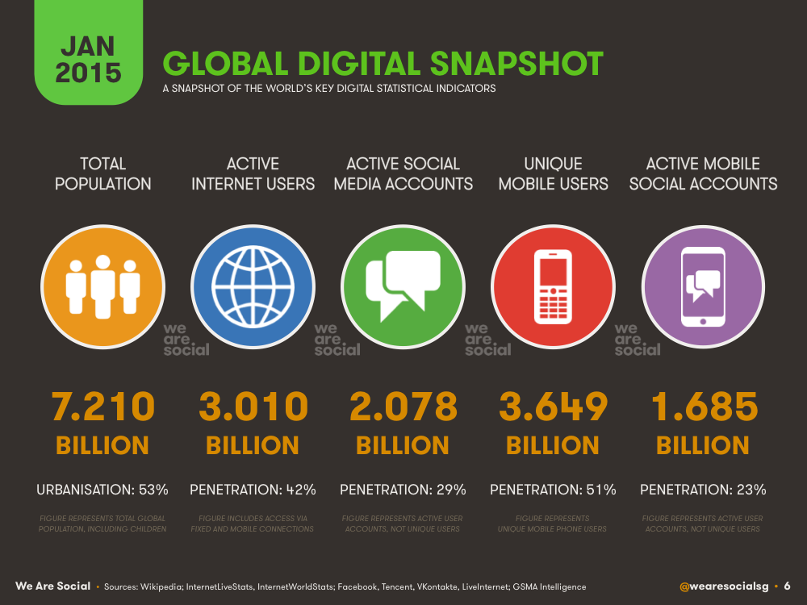

## CARD.com’s View of the World

\centering


<!--
aar
especially if your target audience is those folks, who would like to order a prepaid debit card with an "I love R" logo -- right? The internet penetration among these guys is probably around 100%.
-->

## CARD.com’s View of the World

<!--
anyway, we have of course other designs as well (like several thousands), which is pretty cool for data scientist like us -- to compare the behaviour and compute the performance of eg a "walking dead" or "grumpy cat" cardholder -- which is, believe it or not, different!
-->

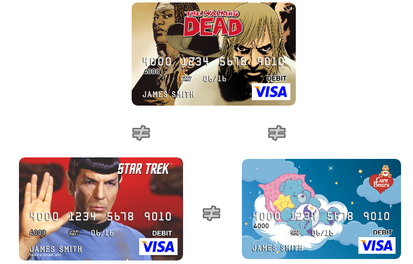

## Modern Marketing

<!--
and here comes the Facebook Marketing API and other online ad platforms -- 
as we have these different card designs with different associated cardholder behaviour  -- that we advertise, by having very different data sources like transactions, interactions on our homepage, mobile app, IVR or e-mail, ad performance metrics, data from our parters etc

that we continuously analyze and use as a training data in our models deciding on future ads
-->

\centering

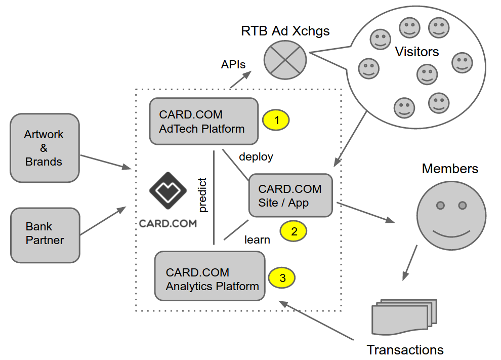

## Modern Advertising

<!--

-->

\Large

* Google knows what you are searching for

\vfill

* Amazon knows what you are in the market for

\vfill

* Facebook knows what you like

\vfill

## Modern Advertising

\Large

* Google knows what you are searching for

<!-- by Johannes Burkhardt -->

\footnotesize

```r
devtools::install.github('jburkhardt/RAdwords')
```

\Large

* Amazon knows what you are in the market for

\footnotesize

```r
NULL
```

\Large

* Facebook knows what you like

\footnotesize

```r
devtools::install.github('cardcorp/fbRads')
```

\vfill \normalsize

\pause

* This info ~~can be~~ is used to advertise to you ...

\pause

* ... without much privacy concerns. How?

## When to Advertise on Facebook

\centering

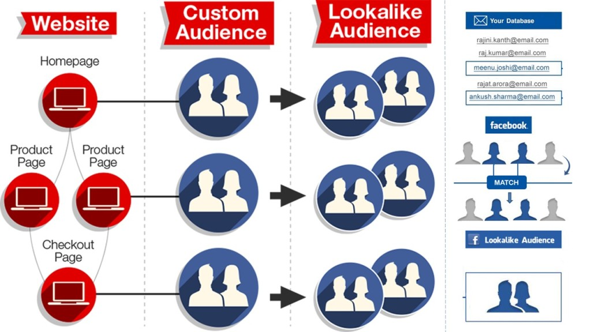

Source: [adparlor.com](http://www.adparlor.com/facebook-website-custom-audience-targeting-the-power-of-precision)

## Anatomy of a Facebook Ad Campaign

\centering

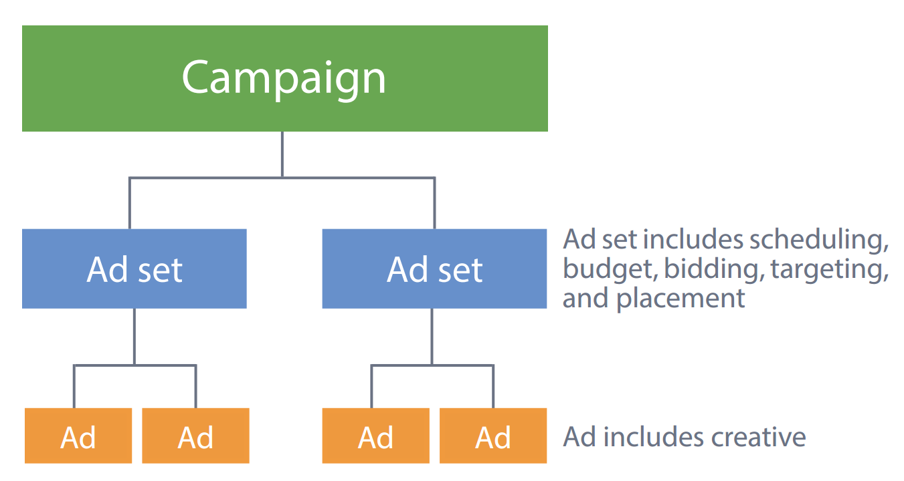

Source: [Facebook Marketing API docs](https://developers.facebook.com/docs/marketing-apis)

## Facebook Ad Campaign Changes

\centering \footnotesize

[https://developers.facebook.com/docs/marketing-api/changelog](https://developers.facebook.com/docs/marketing-api/changelog)

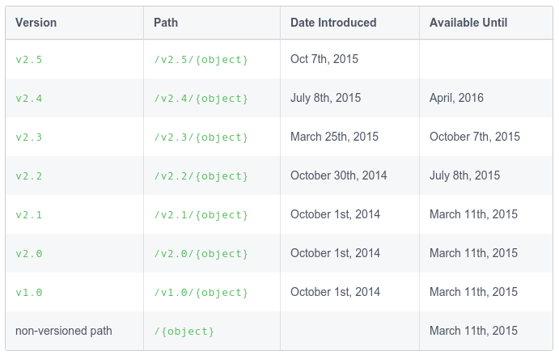

## Facebook Ad Campaign Changes

* new API version every 6 months

2014:

* campaigns: start/end date, budget
* ads: targeting, placement, creative

* Ad Report Stats

2015:

* campaigns [`campaign_group`]: start/end date
* adset [`campaign`]: budget, targeting, placement
* ads [`ad_group`]: creative

* Insights API

2016: 

* Consistent naming between API and UI

<!--
ad (whatever is it)
-->

## Has anyone seen this?

\centering

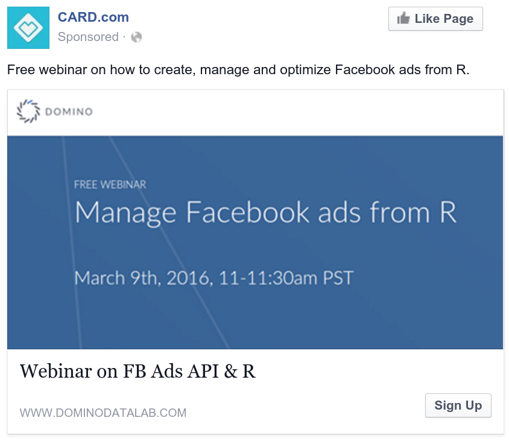

## Has anyone seen this?

\centering

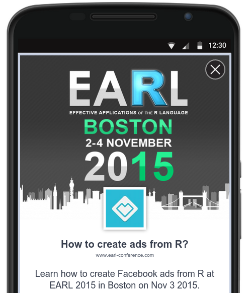

## Has anyone seen this?

\centering


## Get R package developer e-mails

\centering

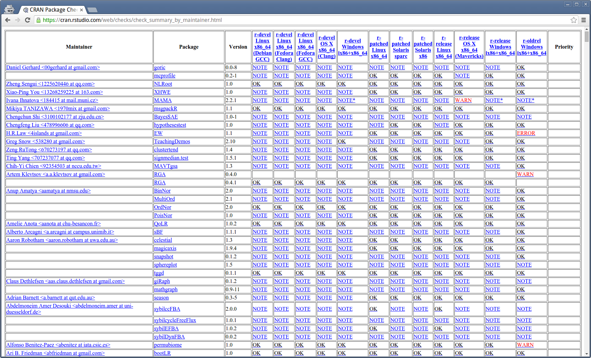

## Get R package developer e-mails

\footnotesize

```r
> url <- 'http://cran.r-project.org/web/checks/check_summary.html'
> packages <- XML::readHTMLTable(url, which = 2)
> mails <- sub('.*<(.*)>', '\\1', packages$' Maintainer')
> mails <- sub(' at ', '@', mails)
```

\pause

```r
> tail(sort(table(mails)))
## edd@debian.org (35)             # Dirk Eddelbuettel
## Kurt.Hornik@R-project.org (29)  # Kurt Hornik
## myrmecocystus@gmail.com (24)    # Scott Chamberlain
## maechler@stat.math.ethz.ch (24) # Martin Maechler
## pgilbert.ttv9z@ncf.ca (22)      # Paul Gilbert

> length(unique(mails))
## 4023

> tail(sort(table(sub('.*@', '', mails))))
## gmail.com (1778)
## R-project.org (84)
## edu
```

## Get R package developer e-mail addresses

\centering

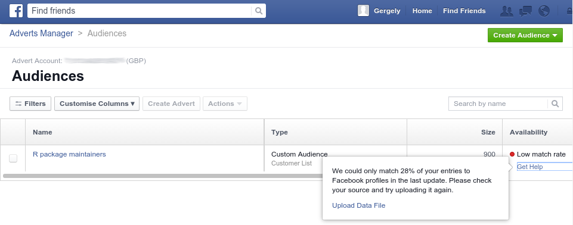

28 % match: only 900 accounts for 6,000+ R packages

## Get e-mails from [R-help]

\footnotesize

Get the location of the archives:
```r
> url <- 'https://stat.ethz.ch/pipermail/r-help/'
```

We need RCurl for HTTPS:
```r
> library(RCurl)
```

Get URL of all archive files:
```r
> R.help.toc <- htmlParse(getURL(url))
> R.help.archives <- unlist(
+     xpathApply(R.help.toc, "//table//td[3]/a", xmlAttrs),
+     use.names = FALSE)
```

Download archive files:
```r
> dir.create('r-help')
> for (f in R.help.archives)
+     download.file(url = paste0(url, f),
+                   file.path('help-r', f), method = 'curl')
```

## Extract e-mail addresses from [R-help]

Regular expression matching date format in "From" lines:
```r
> dateregex <- paste('[A-Za-z]{3} [A-Za-z]{3} [0-9]{1,2}',
+                    '[0-9]{2}:[0-9]{2}:[0-9]{2} [0-9]{4}')
```

`grep` for lines matching the `From` field:
```r
> mails <- system(paste0(
+     "zgrep -E '^From .* at .* ",
+     dateregex,
+     "' ./help-r/*.txt.gz"),
+                 intern = TRUE)
```

Extract e-mail addresses from these lines:
```r
> mails <- sub('.*From ', '', mails)
> mails <- sub(paste0('[ ]*', dateregex, '$'), '', mails)
> mails <- sub(' at ', '@', mails)
```

## Verify e-mail addresses from [R-help]

```r
> length(mails)
266449

> head(sort(table(mails), decreasing = TRUE))
   ripley@stats.ox.ac.uk   dwinsemius@comcast.net
                    8611                     7064
 ggrothendieck@gmail.com p.dalgaard@biostat.ku.dk
                    5386                     3243
      jholtman@gmail.com   smartpink111@yahoo.com
                    3193                     2999
```

## Verify e-mail addresses from [R-help]

\scriptsize

```r
> grep('Brian( D)? Ripley', names(table(mails)), value = TRUE)
 [1] "Brian D Ripley"
 [2] "Brian D Ripley [mailto:ripley at stats.ox.ac.uk]"
 [3] "Brian Ripley"
 [4] "Brian Ripley <ripley at stats.ox.ac.uk>"
 [5] "Prof Brian D Ripley"
 [6] "Prof Brian D Ripley [mailto:ripley at stats.ox.ac.uk]"
 [7] "         Prof Brian D Ripley <ripley at stats.ox.ac.uk>"
 [8] "\"Prof Brian D Ripley\" <ripley at stats.ox.ac.uk>"
 [9] "Prof Brian D Ripley <ripley at stats.ox.ac.uk>"
[10] "Prof Brian Ripley"
[11] "Prof. Brian Ripley"
[12] "Prof Brian Ripley [mailto:ripley at stats.ox.ac.uk]"
[13] "Prof Brian Ripley [mailto:ripley at stats.ox.ac.uk] "
[14] "          \tProf Brian Ripley <ripley at stats.ox.ac.uk>"
[15] "  Prof Brian Ripley <ripley at stats.ox.ac.uk>"
[16] "\"Prof Brian Ripley\" <ripley at stats.ox.ac.uk>"
[17] "Prof Brian Ripley<ripley at stats.ox.ac.uk>"
[18] "Prof Brian Ripley <ripley at stats.ox.ac.uk>"
[19] "Prof Brian Ripley [ripley at stats.ox.ac.uk]"
[20] "Prof Brian Ripley <ripley at toucan.stats>"
[21] "Professor Brian Ripley"
[22] "r-help-bounces at r-project.org [mailto:r-help-bounces at r-project.org] On Behalf Of Prof Brian Ripley"        
[23] "r-help-bounces at stat.math.ethz.ch [mailto:r-help-bounces at stat.math.ethz.ch] On Behalf Of Prof Brian Ripley"
```

## Verify e-mail addresses from [R-help]

```r
> length(mails)
266449

> head(sort(table(mails), decreasing = TRUE))
   ripley@stats.ox.ac.uk   dwinsemius@comcast.net
                    8611                     7064
 ggrothendieck@gmail.com p.dalgaard@biostat.ku.dk
                    5386                     3243
      jholtman@gmail.com   smartpink111@yahoo.com
                    3193                     2999

> length(unique(mails))
29266

> 29266 > 4023
TRUE \o/
```

## Authenticate with the Facebook API

\centering

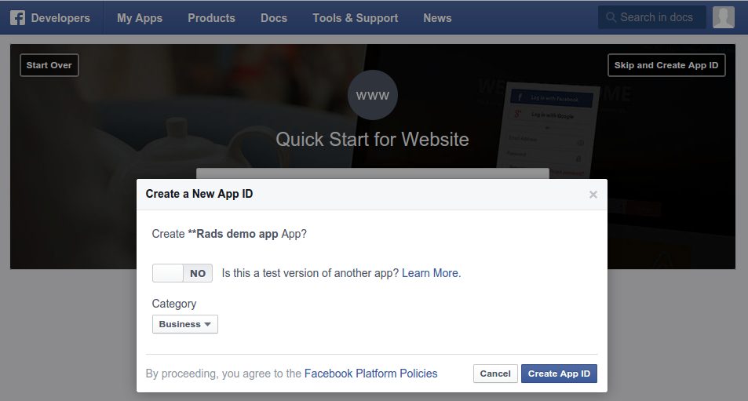

https://developers.facebook.com/apps/

## Authenticate with the Facebook API

Create a token: \footnotesize

```r
> library(httr)
> app <- oauth_app('facebook', 'your_app_id', 'your_app_secret')
> Sys.setenv('HTTR_SERVER_PORT' = '1410/')
> tkn <- oauth2.0_token(
+   oauth_endpoints('facebook'), app, scope = 'ads_management',
+   type  = 'application/x-www-form-urlencoded')
> tkn <- tkn$credentials$access_token
```

\normalsize
Save this secret token (never commit to git repository) and load it in any later session: \footnotesize

```r
> saveRDS(tkn, 'token.rds')
> tkn <- readRDS('token.rds')
```

## The fun begins!

\normalsize
Initialize connection to Facebook Marketing API:
\footnotesize

```r
> devtools::install_packages('cardcorp/fbRads')
> library(fbRads)
> fbad_init(fid, tkn)
```

## Create custom audience

```r
> aud_id <- fbad_create_audience(name = 'R-help posters',
+     title = 'Unique e-mail addresses in R-help 1997-2015')
```

Reading audience info:
```r
> fbad_read_audience(audience_id = aud_id,
+     fields = 'approximate_count')
20
```

Adding e-mails to audience (be patient):
```r
> fbad_add_audience(audience_id = aud_id,
+    schema = 'EMAIL', hashes = mails)
> fbad_read_audience(audience_id = aud_id,
+    fields = 'approximate_count')
8700
```

## Create lookalike audiences

\footnotesize

Load the number of attendees per country:
```r
> url <- 'http://rapporter.net/custom/R-activity/data/Rstats_2015.csv'
> library(data.table)
> RpC <- fread(url)
> conference_countries <- RpC[user_all > 0, ]
```

Create a lookalike audience for each country with at least one useR! conference attendee:
```r
> aud_ids <- sapply(1:nrow(conference_countries), function(i) {
+
+   try(fbad_create_lookalike_audience(
+     name               = paste('R-help posters in',
+                                conference_countries[i, NAME]),
+     origin_audience_id = aud_id,
+     ratio              = 0.01,
+     country            = toupper(conference_countries[i, ISO2C])))
+
+     Sys.sleep(20)
+
+ })
```

## Read lookalike audiences

\footnotesize

Get the approximate count of each lookalike audience:
```r
> lookalikes[!is.na(audience),
+     size := fbad_read_audience(audience, 'approximate_count')[[1]],
+     by = country]

> lookalikes[!is.na(audience), c('country', 'size'), with = FALSE]
           country    size                     country    size
 1:      Australia  173000          13:        Ireland   32800
 2:        Austria   41500          14:          Italy  336200
 3:        Belgium   72400          15:         Latvia    7800
 4:         Brazil 1280400          16:         Mexico  758100
 5:         Canada  253100          17:    Netherlands  110900
 6:       Colombia  308200          18:    New Zealand   34500
 7:  Faroe Islands     400          19:         Norway   36500
 8:         France  392900          20:      Singapore  257000
 9:        Germany  347700          21:       Slovenia   11200
10:         Greece   59900          22:          Spain  284200
11:        Hungary   61500          23:    Switzerland   43100
12:          India 2042000          24: United Kingdom  478700
                                    25:  United States 2483200
```

## Create a campaign

\footnotesize

```r
> campaign <- fbad_create_campaign(
+     name      = 'Promote the Domino Data Lab webinar',
+     objective = 'LINK_CLICKS')
> fbad_read_campaign(id = campaign,
+     fields = c('id', 'buying_type', 'name', 'objective'))
$id
[1] "********"

$buying_type
[1] "AUCTION"

$campaign_group_status
[1] "ACTIVE"

$objective
[1] "NONE"

$name
[1] "Promote the Domino Data Lab webinar"

```

## Define target for an adset

All valid lookalike audiences:
```r
> target <- lookalikes[!is.na(audience)]
> setnames(target, c('name', 'id'))
```

The original R-help posters list:
```r
> target <- rbind(target, list('R-help poster list', id1))
```

The original R package developers list:
```r
> target <- rbind(target, list('R pkg developers list', id2))
```

Prepare JSON list:
```r
> target <- list(custom_audiences = target)
```

## Create an adset

This is where we define the target and budget:

```r
> adset <- fbad_create_adset(
+     name = 'Promo budget for the Domino Data Lab webinar',
+     campaign_id = campaign,
+     billing_event = 'IMPRESSIONS',
+     optimization_goal = 'REACH',
+     bid_amount = 5,
+     campaign_status = 'ACTIVE',
+     lifetime_budget = 4200,
+     end_time = as.numeric(as.POSIXct('2016-03-09')),
+     targeting = target)
```

## Upload image

Get an image for the ad:
\scriptsize

```r
> img <- 'Domino-fbRads-webinar.png'
> download.file('https://www.dominodatalab.com/resource/webinar/fbRads/Header.jpg', img)
```

\normalsize
Upload to Facebook:
\footnotesize

```r
> img <- fbad_create_image(img = img)
```

\normalsize
Take a note on the returned hash:
\footnotesize

```r
> str(img)
List of 3
 $ filename: chr "Domino-fbRads-webinar.png"
 $ hash    : chr "0af72a03b5b91a7201718ec2f06513dd"
 $ url     : chr "https://scontent.xx.fbcdn.net/hads-xfp1/t45.1600-4/12408962_6036679267963_1431006528_n.png"
> img <- img$hash 
```

## Create a creative

```r
> url <- file.path('https://www.dominodatalab.com/resource/webinar/',
+                  'managing_optimizing_facebook_ad_campaigns_with_r'),
> (creative <- fbad_create_creative(
+      name = 'How to create ads from R?',
+      body = paste(
+          'Free webinar on how to create, manage',
+          'and optimize Facebook ads from R'),
+      title      = 'How to create ads from R?',
+      object_url = url,
+      image_hash = img$hash))
[1] 6036679347163
```

## Preview the creative

\centering


## Create an ad

```r
> ad <- fbad_create_ad(
+     name     = 'An ad -- right from the R console',
+     adset_id = adset,
+     creative = creative)
```

## Scalability

\centering
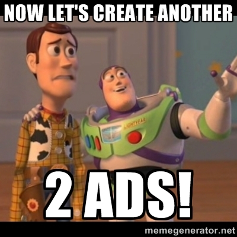

## A/B testing

\scriptsize

```r
> taglines <- c('How to manage ads from R?',
+               'How to optimize ads from R?')

> for (tagline in taglines) {
+
+     ## create creative
+     creative <- fbad_create_creative(
+         name = tagline,
+         body = paste(
+          'Free webinar on how to create, manage',
+          'and optimize Facebook ads from R'),
+         title      = tagline,
+         object_url = url,
+         image_hash = img$hash)
+
+     ## create ad
+     ad <- fbad_create_ad(
+         name        = paste0(tagline),
+         campaign_id = adset,
+         creative    = creative)
+
+ }
```

## Performance metrics

\centering

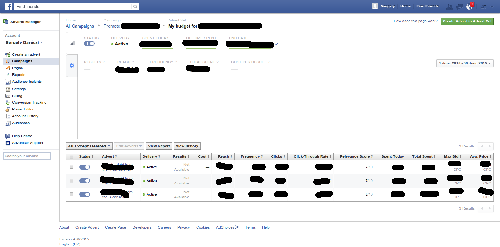

## Performance metrics

```r
> fb_insights(target = campaign, level = 'adgroup',
+   fields = toJSON(c('reach', 'impressions', 'clicks')))

  reach impressions clicks date_start  date_stop
1 16936       22369    119 2015-10-26 2015-11-02
2  7259        8318     29 2015-10-26 2015-11-02
3 19134       22539     63 2015-10-26 2015-11-02
```

\pause

```r
> fb_insights(target = campaign, level = 'adgroup',
+   fields = toJSON(c('adgroup_name', 'cpc', 'cpp')))

  adgroup_name       cpc date_start  date_stop
1 Optimize ads 0.2344538 2015-10-26 2015-11-02
2   Manage ads 0.5031034 2015-10-26 2015-11-02
3   Create ads 0.4974603 2015-10-26 2015-11-02
```

## Performance metrics

\tiny

```{r, prompt=TRUE, comment=''}
power.prop.test(p1 = 97 / 15682, p2 = 15 / 6672, power = 0.5, sig.level = 0.05)
fisher.test(data.frame(B = c(97, 15682), A = c(15, 6672)), conf.int = FALSE)
```


## What Could Possibly Go Wrong? 

Query sent to Facebook: \scriptsize

```r
mystats <- fb_insights(date_preset = 'today', level = 'adgroup')
```

\pause\normalsize

Expected results: \scriptsize

```r
 $ adgroup_id                : chr  "..." "..." "..."
 $ campaign_id               : chr  "..." "..." "..."
 $ campaign_group_id         : chr  "..." "..." "..."
 $ account_id                : chr  "..." "..." "..."
 $ frequency                 : num  1.11 1.01 1.28
 $ impressions               : chr  "431" "280" "2735"
 $ reach                     : int  390 277 2140
 $ cpc                       : num  0.188 0.3 0.243
 $ cpm                       : num  2.18 3.21 1.07
 $ cpp                       : num  2.41 3.25 1.36
 $ ctr                       : num  1.16 1.071 0.439
```

\pause\normalsize

Response: \scriptsize

```json
Error in fb_insights(date_preset = "today", level = "adgroup") (from fb_insights.R#96) : 
  (#100) Param level must be one of {ad, adset, campaign, account}
```

## What Could Possibly Go Wrong? 

Query sent to Facebook: \scriptsize

```r
mystats <- fb_insights(date_preset = 'today', level = 'ad')
```

\pause\normalsize

Expected results: \scriptsize

```r
 $ adgroup_id                : chr  "..." "..." "..."
 $ campaign_id               : chr  "..." "..." "..."
 $ campaign_group_id         : chr  "..." "..." "..."
 $ account_id                : chr  "..." "..." "..."
 $ frequency                 : num  1.11 1.01 1.28
 $ impressions               : chr  "431" "280" "2735"
 $ reach                     : int  390 277 2140
 $ cpc                       : num  0.188 0.3 0.243
 $ cpm                       : num  2.18 3.21 1.07
 $ cpp                       : num  2.41 3.25 1.36
 $ ctr                       : num  1.16 1.071 0.439
```

\pause\normalsize

Response: \scriptsize

```json
Failed to connect to 2a03:2880:20:4f06:face:b00c:0:1: Network is unreachable
```

## What Could Possibly Go Wrong? 

Query sent to Facebook: \scriptsize

```r
mystats <- fb_insights(date_preset = 'today', level = 'ad')
```

\pause\normalsize

Response: \scriptsize

```json
Curl (52): Empty reply from server
```

## What Could Possibly Go Wrong? 

Query sent to Facebook: \scriptsize

```r
mystats <- fb_insights(date_preset = 'today', level = 'ad')
```

\pause\normalsize

Response header:

```json
{
  "Vary":["Accept-Encoding"],
  "Content-Type":["text/html"],
  "X-FB-Debug":["..."],
  "Date":["Thu, 24 Sep 2015 16:38:27 GMT"],
  "Connection":["keep-alive"],
  "Content-Length":["19"],
  "status":["503"],
  "statusMessage":["Service Unavailable"]
}
```

## What Could Possibly Go Wrong? 

Query sent to Facebook: \scriptsize

```r
mystats <- fb_insights(date_preset = 'today', level = 'ad')
```

\pause\normalsize

Header: \scriptsize

```json
{"Content-Type":["text/html; charset=utf-8"], ..., "status":["502"],
"statusMessage":["Error parsing server response"]}
```

\pause \normalsize

Response: \scriptsize

```html
<!DOCTYPE html>
<html lang="en" id="facebook">
  <head>
    <title>Facebook | Error</title>
  </head>
  <body>
    <h1 id="sorry">Sorry, something went wrong.</h1>
    <p id="promise">We're working on it and we'll get it fixed as soon as we can.</p>
  </body>
</html>
```

## What Could Possibly Go Wrong? 

Query sent to Facebook: \scriptsize

```r
mystats <- fb_insights(date_preset = 'today', level = 'ad')
```

\pause\normalsize

Header: \scriptsize

```json
{"Content-Type":["application/json; charset=UTF-8"], ..., "status":["200"],
"statusMessage":["OK"]}
```

\pause \normalsize

Response: \scriptsize

```json
{
  "id":["..."],
  "account_id":["..."],
  "time_ref":[...],
  "async_status":["Job Failed"],
  "async_percent_completion":[0]
}
```

## What Could Possibly Go Wrong?

Possible issues with the API calls:

1. Network error (network is unreachable)
2. Curl error (52)
3. HTTP error (503)
4. JSON syntax error (HMTL)
5. Facebook API error message


## Error handling

Possible issues with the API calls using `fbRads` from `R`:

1. ~~Network error (network is unreachable)~~
2. ~~Curl error (52)~~
3. ~~HTTP error (503)~~
4. ~~JSON syntax error (HMTL)~~
5. ~~Facebook API error message~~

## Error handling

\scriptsize

```r
> mystats <- fb_insights(date_preset = 'today', level = 'ad')

ERROR [2015-11-01 08:27:44] Possible network error: Empty reply from server
INFO [2015-11-01 08:28:14] Retrying query for the 1  st/nd/rd time
ERROR [2015-11-01 08:28:14] Possible network error: Empty reply from server
INFO [2015-11-01 08:28:44] Retrying query for the 2  st/nd/rd time
DEBUG [2015-11-01 08:28:44] Sync request failed, starting async request.
DEBUG [2015-11-01 08:28:45] *** Async Job Not Started (0%). Waiting 2 seconds...
DEBUG [2015-11-01 08:28:47] *** Async Job Started (0%). Waiting 10 seconds...
ERROR [2015-11-01 08:28:57] {"id":["***"],..., "async_status":["Job Failed"]}
INFO [2015-11-01 08:28:57] Retrying query for the 1 st/nd/rd time
DEBUG [2015-11-01 08:28:57] *** Async Job Not Started (0%). Waiting 2 seconds...
DEBUG [2015-11-01 08:29:00] *** Async Job Started (0%). Waiting 10 seconds...
DEBUG [2015-11-01 08:29:10] *** Async Job Running (17%). Waiting 7.5 seconds...
DEBUG [2015-11-01 08:29:17] *** Async Job Running (35%). Waiting 5.6 seconds...
DEBUG [2015-11-01 08:29:23] *** Async Job Running (53%). Waiting 4.2 seconds...
DEBUG [2015-11-01 08:29:28] *** Async Job Running (71%). Waiting 3.2 seconds...
DEBUG [2015-11-01 08:29:31] *** Async Job Running (71%). Waiting 15.8 seconds...
```

## Support for async/batch queries

\scriptsize

```r
> mystats <- fb_insights(date_preset = 'today', level = 'ad')

DEBUG [2015-11-01 08:28:56] Sync request failed, starting async request.
DEBUG [2015-11-01 08:28:57] *** Async Job Not Started (0%). Waiting 2 seconds...
DEBUG [2015-11-01 08:29:00] *** Async Job Started (0%). Waiting 10 seconds...
DEBUG [2015-11-01 08:29:10] *** Async Job Running (17%). Waiting 7.5 seconds...
DEBUG [2015-11-01 08:29:17] *** Async Job Running (35%). Waiting 5.6 seconds...
DEBUG [2015-11-01 08:29:23] *** Async Job Running (53%). Waiting 4.2 seconds...
DEBUG [2015-11-01 08:29:28] *** Async Job Running (71%). Waiting 3.2 seconds...
DEBUG [2015-11-01 08:29:31] *** Async Job Running (71%). Waiting 15.8 seconds...
```

----

\centering

https://github.com/cardcorp/fbRads


## Keyword-based targeting

\scriptsize

```r
## Number of R users on Facebook
> (fbr <- fbad_get_search(q = 'rstats', type = 'adinterest')[, c(1:3, 6)])
             id                     name audience_size                 topic
1 6003212345926 R (programming language)       1602320 Lifestyle and culture
```

\pause

```r
## Number of programmers on Facebook
> fbprog <- fbad_get_search(q = 'programming language', type = 'adinterest')
> head(fbprog[order(fbprog$audience_size, decreasing = TRUE), ], 10)[, 1:3]
              id                          name audience_size
1  6003030200185          Programming language     269482400
67 6003017204650                           PHP      37701920
2  6003476678525    Boo (programming language)      31028180
68 6004131486306                           C++      26812460
69 6003215894612            Ajax (programming)      14547070
3  6003682002118 Python (programming language)      14286850
70 6003127967124                    JavaScript      12124380
4  6002979703120   Ruby (programming language)      11146690
5  6003437022731   Java (programming language)       9547610
71 6003568029103   Object-oriented programming       9490910
```

## Targeting overlaps

\scriptsize

```r
## US-based R users on Facebook
> fbad_reachestimate(targeting_spec = list(
+     geo_locations = list(countries = 'US'),
+     flexible_spec = list(list(
+         interests = data.frame(
+             id   = fbr$id,
+             name = fbr$name)))))$users
[1] 200000
```

\pause

```r
> fbprog <- data.table(fbprog)[name %in% c(
+     'R (programming language)',
+     'Python (programming language)',
+     'Java (programming language)')]

## US-based R, Python or Java users on Facebook
> fbad_reachestimate(targeting_spec = list(
+     geo_locations = list(countries = 'US'),
+     flexible_spec = list(list(
+         interests = data.frame(
+             id   = fbprog$id,
+             name = fbprog$name)))))$users
[1] 1700000
```

## Targeting overlaps

\scriptsize

```r
## US-based R, but non-Python or Java users on Facebook
> fbad_reachestimate(targeting_spec = list(
+     geo_locations = list(countries = 'US'),
+     flexible_spec = list(list(
+         interests = data.frame(id = fbr$id, name = fbr$name))),
+     exclusions = list(interests = data.frame(
+             id   = fbprog$id[1:2],
+             name = fbprog$name[1:2]))))$users
[1] 190000

## US-based R, Python and Java users on Facebook
> fbad_reachestimate(targeting_spec = list(
+     geo_locations = list(countries = 'US'),
+     flexible_spec = list(
+         list(interests = data.frame(
+             id   = fbprog$id[1],
+             name = fbprog$id[1])),
+         list(interests = data.frame(
+             id   = fbprog$id[2],
+             name = fbprog$id[2])),
+         list(interests = data.frame(
+             id   = fbprog$id[3],
+             name = fbprog$id[3])))))$users
[1] 5300
```

## Targeting overlaps

\centering

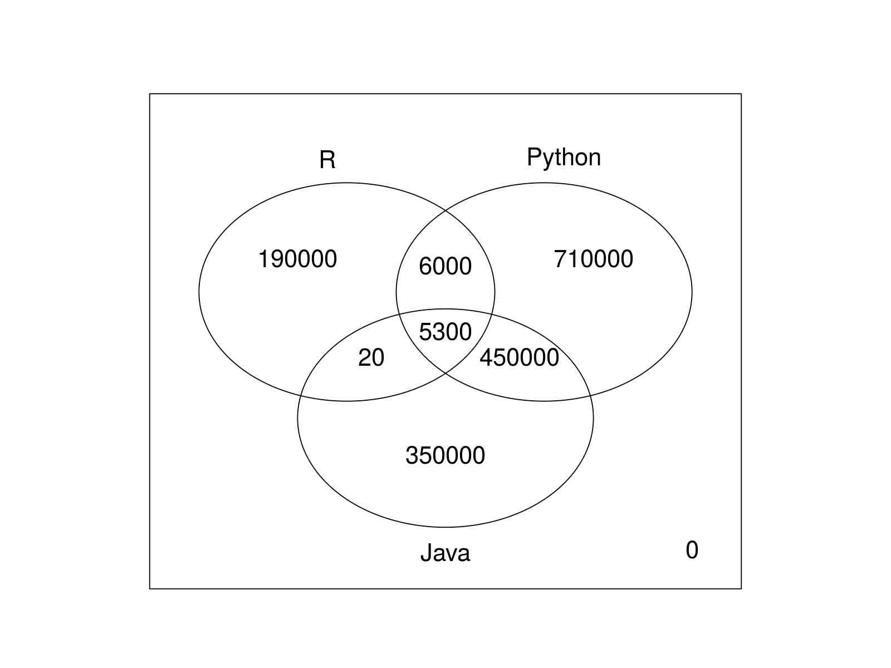
